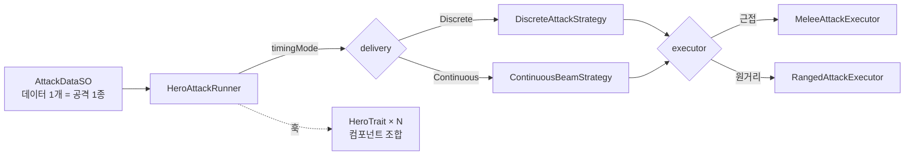
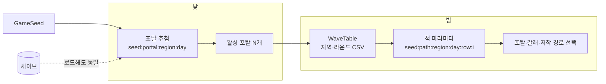
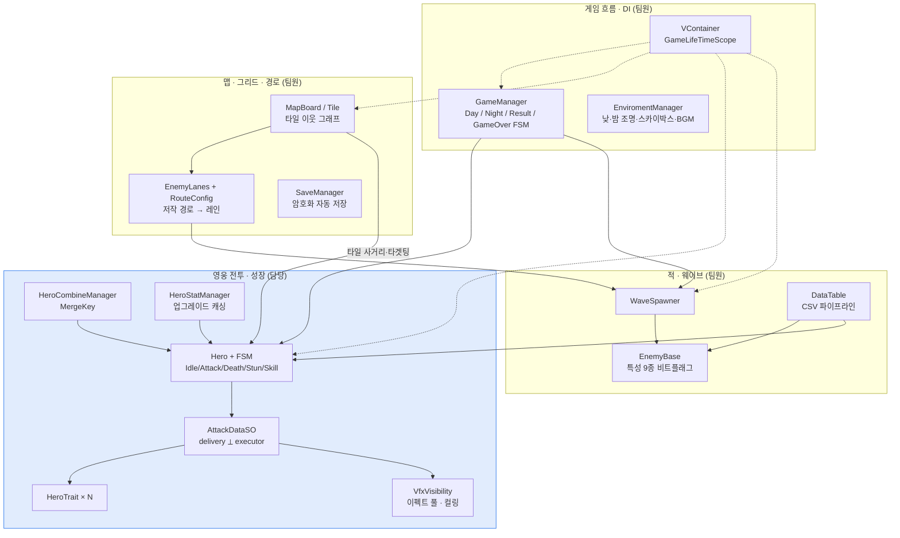

# PioneerOfFelucia

> 낮에는 마을을 세우고, 밤에는 그리드에 배치한 영웅으로 웨이브를 막는 **시티빌딩 × 그리드 타워디펜스** 하이브리드.


<!-- ▶️ 플레이 가능한 빌드가 있으면 이 줄에 itch.io 등 링크를 최상단에 배치 -->

<!-- 게임플레이 GIF (ShareX 녹화, docs/ 에 넣고 아래 표 주석 해제)
| 낮 ↔ 밤 전환 | 영웅 전투 VFX (장판 · 빔 · 체인) | 유닛 합성 |
| :---: | :---: | :---: |
|  |  |  |
-->

<sup>저장소명 `GyoungYilARK` 는 개발 초기 코드네임이며, 프로덕트명은 `PioneerOfFelucia` 입니다.</sup>

---

## 프로젝트 개요

| 항목 | 내용 |
| --- | --- |
| 장르 | 시티빌딩 × 그리드 타워디펜스 하이브리드 |
| 플랫폼 | PC (세로 화면) |
| 팀 구성 | 프로그래머 4인 |
| 개발 기간 | 2026.07 ~ 2026.09 |
| 엔진 | Unity `6000.3.15f1` (Unity 6.3) / URP `17.3` |

## 게임 구성

### 생산 구역
**생산 건물**
- 제재소(목재), 채석장(돌), 제철소(철), 광산(금), 농장(식량), 주택(최대 인구 수 증가)
- 자원을 소모하여 업그레이드할 수 있습니다. 업그레이드 시 자원 획득량이 증가합니다.

**시민 투입**
- 시민은 식량을 소모하여 생성합니다.
- 생산 건물에 시민을 투입해야 자원을 획득할 수 있습니다.
- 투입된 시민 수에 비례하여 자원을 획득합니다.

**자원 획득**
- 밤(웨이브)가 끝날 때마다 생산 건물에서 자원을 획득합니다.

### 전투 구역
**영웅**
- 자원을 소모하여 영웅을 생성할 수 있습니다.
- 같은 영웅 3명이 있을 때 합성할 수 있습니다. 다음 티어의 랜덤한 영웅으로 합성됩니다.
- 자원을 소모하여 업그레이드할 수 있습니다. 업그레이드 시 스탯이 증가합니다.

**적**
- 스폰 지점으로부터 본진까지 경로를 따라 이동합니다.
- 사거리 안의 영웅과 전투하고 본진에 침투하면 본진 체력이 감소되며 소멸합니다.

## 기술적 하이라이트

### 1. 데이터 주도 공격 시스템

**공격 ScriptableObject**로 모든 영웅의 공격 데이터 작성
- 탐지 범위, 형태, 타격 종류, 멀티샷, 타겟 분배, 타이밍, 버프, 디버프, 장판, 이펙트, 사운드를 모두 필드로 노출

실행은 **서로 독립된 두 축의 전략**으로 분리

**공격 타이밍**
- `DiscreteAttackStrategy` : 애니메이션 이벤트 윈도우 기반 1회
- `ContinuousBeamStrategy` : tick 주기로 채널링

**실행자**
- MeleeAttackExecutor(근거리), RangedAttackExecutor(원거리)

**영웅 트레잇**
- 트레잇은 SO가 아니라 같은 프리팹에 붙은 컴포넌트
- 영웅이 공격할 때, 트레잇 컴포넌트를 참조하여 함수 실행
코드 변경 없이 만들어진 AttackData 에셋 51개




### 2. 영웅 스탯, 업그레이드 파이프라인 - 레이어 분리로 가산 그룹 오염 방지

**스탯 변화**
- 클래스 업그레이드 - 근거리, 원거리 업그레이드, 게임 진행 중 자원 사용
- 기초 업그레이드– 게임 외 재화로 업그레이드, 게임 시작 시 적용
- 런타임 버프 – 플레이어 스킬로 인한 버프, 적들의 공격으로 인한 디버프

**구현**
- 스탯 레이어 분리 - 서로 다른 출처가 한 합에 섞이지 않게 함(업그레이드, 버프)
- 스탯 연산 순서 고정 - base + (Flat 합) --> x (1 + 업그레이드 가산) --> x ( 1 + 버프 가산) --> x (1 + 곱연산)
- 수정자 - 스탯 변화는 수정자를 추가/제거로 적용
- 소스 태깅 - 특정 소스가 준 수정자만 정확히 제거
- 더티 플래그 - 수정자가 바뀔 때만 재계산, 그 외엔 캐시값 반환
- 스탯 관리자가 업그레이드가 반영된 base 스탯을 영웅 데이터 단위로 미리 계산, 캐싱하고 갱신 시 base만 교체

### 3. 영웅 합성

**키 기반 분류**
- 영웅 종류마다 MergeKey가 다름. MergeKey로 같은 영웅인지 판정
- 보유한 영웅들 동일한 MergeKey를 가진 영웅들을 묶어서 보관

**합성**
- 대상 영웅과 MergeKey가 같은 영웅들 확인
- 합성 가능 시, 다음 티어 영웅 랜덤 선택 후 합성

### 4. 전투 VFX 파이프라인 & 파티클 최적화

**문제**
- 영웅, 적 수십 개체가 전투하며 공격 이펙트, 장판, 빔, 디버프 아이콘이 동시에 재생
- 화면 밖 파티클까지 전부 인스턴스화, 재생되면 프레임이 떨어짐

**화면 밖 파티클 제거**
- 순수 연출용 이펙트는 화면 밖이면 인스턴스화 자체를 생략
- 매 프레임 렌더러/파티클 가시성만 토글
- 동일 대상 중복 없음, 최대 3개의 파티클 재생

---

## 게임 시스템

타일맵 · 적 웨이브 · 낮/밤 자원 사이클 · 맵 에디터 — 협업 파트의 핵심 설계.

### 1. 타일맵 · 그리드

**콜라이더 없는 좌표계**
- `Grid` 하나가 좌표계의 단일 소스. 타일은 논리 좌표(`State.Col/Row`)를 직접 들고, 월드 위치는 에디터에서 `TilePosBaker`가 새긴다
- 맵 조각(모듈)마다 좌표가 0-base라 `_bakedOffset`으로 raw Grid 좌표 ↔ 타일 좌표를 정규화
- 클릭 판정은 물리 레이캐스트가 아니라 `CellFromRay` — 타일을 윗면 한 장이 아니라 바닥까지 이어진 기둥으로 보고 맞힌다. 옆면을 눌러도 그 타일이 잡히고, 앞에 선 높은 타일이 뒤 타일을 가린다

**3축 타일 상태**
- 지형(Ground / High / Core / Special / Empty) · 점령(배치된 유닛) · 용도(근접·원거리·생산 배치 허용)를 서로 독립된 축으로 저장
- 통행 가능 여부는 지형이 정한다 — 지상·본진만 통행, 고지·빈 칸은 길을 막는다
- 적 점유(`Enemies`)는 유닛 점유(`OccupantObject`)와 별개다: 한 칸에 여러 마리가 드나든다

**미리 계산해 두는 이웃 · 거리**
- `TileLink.LinkNeighbors`가 Build 때 상하좌우 이웃을 타일에 새긴다 — A\*가 좌표를 더해 격자를 뒤지지 않고 타일이 든 이웃 목록을 바로 읽는다
- 타일 → 가장 가까운 본진까지 칸 거리를 Build 때 한 번 재 두고(`_coreDistance`), A\* 휴리스틱이 그대로 꺼내 쓴다
- 사거리·타겟팅은 `MapBoard.GetTiles(origin, range)` — 기본 다이아몬드, `square` 옵션으로 정사각형

### 2. 적 웨이브 · 결정적 재현

**문제**
- 포탈은 낮에 추첨하고 적은 밤에 스폰된다. 그 사이에 세이브 로드·일차 복원이 끼어들 수 있다
- 웨이브 행마다 `.Forget()`으로 코루틴이 동시에 돌아, 어느 행의 몇 번째 적이 먼저 뽑히는지가 프레임 타이밍에 따라 달라진다
- 순차 소비형 난수기 하나를 돌려 쓰면 그 순서가 흔들리는 순간 같은 시드에서도 결과가 달라진다

**유도 문자열 분리**
- `(게임 시드, 지역, 일차)` → 그날 열리는 포탈
- `(게임 시드, 지역, 일차, 웨이브 행, 마릿수 인덱스)` → 적 한 마리가 어느 포탈에서 어느 갈래로 나오는지
- 포탈 개수·조합·경로 추첨을 각각 다른 유도 키(`:portalcount` / `:portalpick` / `:path`)로 뽑는다 — 개수 하나가 바뀌어도 뒤따르는 추첨이 통째로 밀리지 않는다
- 세이브를 다시 로드해도 그날 포탈과 적별 경로까지 그대로 재현된다

**웨이브 스케일링**
- `WaveTable` CSV로 지역·라운드별 몹 구성 저작
- 10일차 초과는 1001~1005 라운드로 순환 조회(`GetStageLookupId`), 마릿수는 라운드가 돌수록 배율(`GetScaleCount`)
- 증원 — 해금 지역 수 − 1 단계만큼 자기 지역 전용 증원 몹(`ReinforceBaseId` 9001+)이 덧붙는다
- 10의 배수 일차는 보스 라운드 — 1지역은 코어에서 가장 먼 "끝 구석" 포탈 1개로 고정(`ActivateCornerPortal`), 보스는 지연 후 등장



### 3. 낮/밤 자원 사이클

**FSM 하루 루프**
- `DayState` : `dayCount++`, 오늘 아침 체력 스냅샷(`todayHp`), 10일차마다 지원 요청 플래그
- `NightState` : 낮 → 밤 연출이 끝나 `CanSpawnEnemy`가 서면 웨이브 스폰
- `ResultState` : 해금된 전 지역 전멸 시 진입, 지원 요청 상태면 다음 모듈 해금 후 낮으로

**자원 획득 — 밤이 끝날 때 한 번**
- `EnviromentManager`가 조명·스카이박스·BGM 보간을 끝낸 뒤 `OnDay` 이벤트를 쏜다
- `FacilityManager`가 그 이벤트에 걸려 `SumProduct` — 생산 건물마다 투입된 시민 수에 비례한 생산량을 합산해 `ResourcesManager`에 넣는다
- 완벽 방어(`Hp == todayHp`)로 밤을 넘기면 특수 자원 1개, 특수 자원은 `TradeResource`로 원하는 자원과 교환

**자원 소모**
- 시민은 식량을 소모해 생성, `CitizenManager`가 생산 투입분(`usedCitizen`)과 영웅 투입분(`heroUsedCitizen`)을 따로 세고 가용분(`CanUseCitizen`)을 계산
- 건물 업그레이드 · 영웅 생성 · 영웅 업그레이드가 자원을 소모, 영웅 생성가는 그날 생성 횟수에 따라 점증(`heroesCreatedToday`)

### 4. 맵 에디터 툴

**Map Maker (`Tools/Map/Map Maker`)**
- 팔레트(무엇을)와 도구(어떻게)를 분리 — 같은 "지상"을 골라도 칠하기는 데이터만 바꾸고 교체는 큐브 실물을 갈아끼운다. 토글 하나로 뜻이 바뀌지 않는다
- 붓질 한 번 = 되돌리기 한 단계(`TileStamp.BeginStroke` / `EndStroke`), Shift+클릭 구간 채우기, Alt+클릭 끄기
- 누르기 전에 이 클릭이 무엇이 될지 알리는 예고줄, 지금 가리키는 칸의 3축 상태를 읽는 상태줄
- 일차 탭 — 날짜별로 다른 적 경로를 저작
- `TileAuthorRule.FindProblems` 저작 린트(경로 끊김·본진 없음 등), `TileOverride`가 "프리팹인 줄 알고 씬 인스턴스를 칠하는" 사고를 표식으로 조기 경고

**그 밖의 메뉴 툴**
- `Tools/Map/Bake Tile Positions` — 큐브 월드 위치에서 타일 좌표를 새김
- `Tools/Enemy/Enemy Route Maker` — 공중·수영 적 저작 경로, `Enemy Icon Baker` — 적 아이콘 일괄 생성
- CSV 임포터 — `Import HeroTable` / `HeroStatTable` / `SkillTable` / `DebuffTable`
- `Tools/Debug/자원 치트`, `Tools/Localize/*` (LocalizeText 키 검사·부착)

---

## 아키텍처



---

## 기술 스택

`Unity 6.3` · `C#` · `URP 17.3` · `Shader Graph` · `VFX Graph`
[`VContainer`](https://github.com/hadashiA/VContainer) (DI) · [`UniTask`](https://github.com/Cysharp/UniTask) (비동기) · `NuGetForUnity`

상태 전이는 게임/영웅 모두 직접 구현한 FSM, 이벤트는 C# `event` 기반이다.

---

## 코드 하이라이트

설계 의도가 드러나는 인터페이스만 발췌 (구현 생략).

```csharp
// "결정된 AttackDataSO 한 방을 어떤 '시간적 형태'로 집행하는가" — Discrete(1회) vs Continuous(채널링).
// executor(무엇으로 때리는가)와 독립된 축. hero 를 함께 받는 이유: AttackContext 는 struct 라
// 넘겨받은 ctx 는 호출 시점 스냅샷이라, 몇 초 도는 채널링 중 "지금 살아있는" 타겟을 다시 확인하려면
// hero 를 직접 들고 있어야 한다.
public interface IAttackDeliveryStrategy
{
    UniTask Deliver(Hero hero, AttackDataSO data, AttackContext ctx,
                    IAttackExecutor executor, CancellationToken ct);
}

// "무엇으로 때리는가" — 근접 / 원거리(투사체) / 힐. 클래스별 AttackState 가 주입한다.
public interface IAttackExecutor
{
    UniTask Execute(AttackDataSO data, AttackContext ctx, CancellationToken ct);
}

// 트레잇은 SO 가 아니라 같은 프리팹에 붙는 컴포넌트다 — Hero.Awake 가 GetComponents 로 수집하고
// 공격/피격/처치/낮 시작 등의 시점에 훅을 팬아웃한다. 새 특성 = 클래스 하나 + 프리팹에 부착.
public abstract class HeroTrait : MonoBehaviour
{
    public virtual void OnAttackPerformed(AttackDataSO data) { }
    public virtual void OnAttackResolved(AttackDataSO data) { }
    public virtual void OnHit(GameObject target, int amount, bool isCrit) { }
    public virtual void OnKill(GameObject target) { }
    public virtual void OnPassiveTick(float deltaTime) { }
    public virtual void OnDayStart() { }
}
```