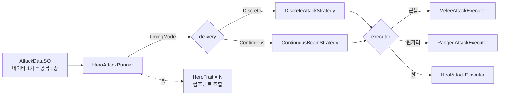
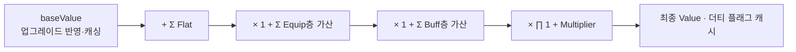
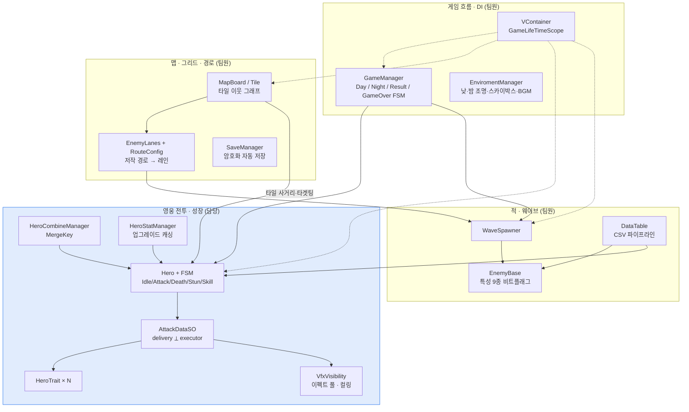

# PioneerOfFelucia

> 낮에는 마을을 세우고, 밤에는 그리드에 배치한 영웅으로 웨이브를 막는 **시티빌딩 × 그리드 타워디펜스** 하이브리드.


<!-- ▶️ 플레이 가능한 빌드가 있으면 이 줄에 itch.io 등 링크를 최상단에 배치 -->

<!-- 게임플레이 GIF (ShareX 녹화, docs/ 에 넣고 아래 표 주석 해제)
| 낮 ↔ 밤 전환 | 영웅 전투 VFX (장판 · 빔 · 체인) | 유닛 합성 |
| :---: | :---: | :---: |
|  |  |  |
-->

<sup>저장소명 `GyoungYilARK` 는 개발 초기 코드네임이며, 프로덕트명은 `PioneerOfFelucia` 입니다.</sup>

---

## 프로젝트 개요

| 항목 | 내용 |
| --- | --- |
| 장르 | 시티빌딩 × 그리드 타워디펜스 하이브리드 |
| 플랫폼 | PC (세로 화면) |
| 팀 구성 | 프로그래머 4인 |
| 개발 기간 | 2026.07 ~ 2026.09 |
| 엔진 | Unity `6000.3.15f1` (Unity 6.3) / URP `17.3` |

### 핵심 루프

- 🌞 **낮** — 지역에 경제 건물을 짓고, 영웅을 뽑아 합성하고, 타일 그리드에 배치·재배치하며 티어·클래스·스탯을 업그레이드한다.
- 🌙 **밤** — 스폰 지점에서 적 웨이브가 저작된 경로를 따라 본진(Core)까지 침투한다. 배치된 영웅은 사거리 안의 적과 자동 전투한다.
- 본진 HP 가 0 이 되면 게임 오버. 진행 상황은 페이즈(낮 시작 / 밤 준비 / 낮 활동)마다 자동 저장된다.

### 담당 범위 (김광환)

**영웅 전투·성장 전반** — 데이터 주도 공격 시스템, 트레잇, 유닛 합성, 업그레이드 파이프라인, 전투 VFX·최적화, 플레이어 스킬 UI.

그 외 영역은 팀원이 담당했다 — 타일 맵·그리드·경로 저작 / 게임 흐름 FSM·DI·경제 / 적 AI·웨이브·데이터테이블. 자세한 분담은 [프로젝트 구조](#프로젝트-구조)의 표 참고.

---

## 기술적 하이라이트

### 1. 데이터 주도 공격 시스템 — 조합 폭발을 상속 대신 컴포지션으로

**문제.** 영웅 데이터가 29종이고, 각 공격은 〈근접 / 원거리 / 힐〉 × 〈단일 / 범위(diamond·square·line) / 체인 / 장판〉 × 〈즉발 / 채널링〉 × 트레잇으로 갈린다. 클래스 상속으로 풀면 `ChainRangedAoEHero` 류의 조합 클래스가 폭발한다.

**선택.**

- 공격 **한 종류 = `AttackDataSO`(ScriptableObject) 하나**. 탐지 범위·형태, 타격 형태, 멀티샷·타겟 분배, 타이밍, 버프·디버프·장판·이펙트·사운드를 전부 필드로 노출하고 `OnValidate()` 로 잘못된 조합을 에디터에서 경고한다.
- 실행은 **서로 독립된 두 축의 전략**으로 분리한다.
  - **delivery (`IAttackDeliveryStrategy`)** — "언제 집행하는가": `DiscreteAttackStrategy`(애니메이션 이벤트 윈도우 기반 1회) / `ContinuousBeamStrategy`(tick 주기로 채널링 — 빔 / 투사체 볼리 / 자기중심 AOE).
  - **executor (`IAttackExecutor`)** — "무엇으로 때리는가": `MeleeAttackExecutor` / `RangedAttackExecutor`(투사체) / `HealAttackExecutor`(아군). 클래스별 `AttackState` 가 주입한다.
- 트레잇은 SO 가 아니라 **같은 프리팹에 붙은 컴포넌트**(`HeroTrait`). `Hero.Awake()` 가 `GetComponents<HeroTrait>()` 로 수집하고, `OnAttackPerformed` / `OnHit` / `OnKill` / `OnDayStart` 등의 훅으로 팬아웃한다.

**근거.** 새 공격 = SO 에셋 하나 생성(코드 0줄), 새 특성 조합 = 프리팹에 컴포넌트 추가. 현재 코드 변경 없이 만들어진 AttackData 에셋이 약 51개다.



📁 `Assets/Script/Hero/AttackDataSO/`, `Assets/Script/Hero/HeroTrait/`

### 2. 영웅 스탯 & 업그레이드 파이프라인 — 레이어 분리로 가산 그룹 오염 방지

**문제.** 하나의 스탯에 티어·클래스·재능 업그레이드(영구), 장착 보너스(%), 런타임 버프(%)가 동시에 얹힌다. 모든 % 수정자를 한 합에 몰아넣으면 장착과 버프가 구분 없이 섞여, 버프가 장착 보너스를 상쇄하거나 스택이 통제 불능으로 커지는 등 카테고리별로 밸런스를 잡기 어려워진다.

**선택.**

- `Stat.Value` 연산 순서를 고정한다 — `base + Σ(Flat)` → `× (1 + Σ Equip층 가산)` → `× (1 + Σ Buff층 가산)` → `× ∏(1 + 곱연산)`.
- `StatLayer { Equip, Buff }` 로 **가산 수정자를 층별로 분리**해 서로 다른 출처가 한 합에 섞이지 않게 한다.
- `Modifier.Source`(object) **소스 태깅** — `RemoveModifier(source)` 로 특정 버프가 준 수정자만 정확히 제거.
- `isModifierChanged` **더티 플래그** — 수정자가 바뀔 때만 재계산, 그 외엔 캐시값 반환.
- `HeroStatManager` 는 업그레이드가 반영된 base 스탯을 `HeroData` 단위로 미리 계산·캐싱하고, 갱신 시 `SetBaseValue` 로 **base 만 교체**해 진행 중인 버프 `Modifier` 를 날리지 않는다.

**근거.** **층 안에서는 가산, 층 사이에서는 곱연산**이다. 장착 +20% 와 버프 +20% 는 각자 자기 층에서만 합쳐진 뒤 서로 곱해진다(`base ×1.2 ×1.2`). 한 카테고리에 수정자가 여러 개 쌓여도 그 안에서만 선형으로 누적되므로, 밸런스를 층 단위로 독립적으로 조정할 수 있다.

> 코어 `StatContainer` / `Stat` 자체는 팀 공용 자산이며, 레이어 분리(`StatLayer`)와 영웅 업그레이드 파이프라인(`HeroStatManager`)이 이 프로젝트에서의 기여 지점이다.



📁 `Assets/GameLoop(ChoiJinWoo)/Scripts/StatContainer/StatLayer.cs`, `Assets/Script/Hero/HeroUpgrade/HeroStatManager.cs`

### 3. 유닛 합성 — MergeKey 아이덴티티 + 배치 승계 규칙

**문제.** 같은 영웅 3개를 합성해 다음 티어 1개를 만드는데, 그 3개는 〈맵에 배치된 인스턴스〉·〈로스터의 미배치 사본〉·〈플레이어가 더블클릭한 대상〉이 섞여 있을 수 있다. 결과 영웅을 어느 칸에 놓고, 어떤 인스턴스를 소비할지가 모호하다.

**선택.**

- `MergeKey`(`readonly struct` — `UnitId`, `Tier`, `IEquatable`)로 "같은 영웅인가" 판정을 한 곳으로 모은다.
- 더블클릭한 대상(`pinnedEntry`)을 **반드시 포함**하고 나머지 2개를 정해진 순서로 채운다.
- 배치 승계 우선순위: **더블클릭 대상이 배치돼 있었으면 그 칸** → 아니면 함께 고른 것 중 배치본의 칸 → 셋 다 미배치면 로스터에 `Available` 엔트리로만 추가(배치는 플레이어가 직접).

**근거.** 아이덴티티(`MergeKey`)와 배치 규칙을 분리해, 합성 실행부(`HeroCombineManager`)는 "제거 / 파괴 / 로스터 갱신 / 배치" 만 담당하고 후보 탐색은 `HeroRegistry` 가 맡는다.

📁 `Assets/Script/Hero/HeroManager/HeroCombineManager.cs`, `Assets/Script/Hero/HeroManager/MergeKey.cs`

### 4. 전투 VFX 파이프라인 & 파티클 최적화

**문제.** 밤 전투는 영웅 수십 명 × (공격 이펙트 / 장판 / 빔 / 디버프 아이콘)이 동시에 돈다. 화면 밖 파티클까지 전부 인스턴스화·재생되면 프레임이 떨어진다.

**선택.**

- `VfxVisibility` — **순수 연출용 이펙트는 화면 밖(마진 포함)이면 인스턴스화 자체를 생략**한다. 계속 살아있어야 하는 이펙트(오라 장판, 아군에 붙는 버프 등)는 인스턴스는 유지하되 매 프레임 렌더러/파티클 가시성만 토글한다.
- 이펙트·투사체 풀을 **`Hero` 인스턴스가 소유**한다 — 씬이 언로드되어 영웅이 파괴되면 풀도 함께 사라져 파괴된 인스턴스를 다시 꺼내는 일이 없다.
- `GroundZoneEffect`(장판) 는 풀에서 꺼내 위치만 잡아주면 데미지/힐 tick·소멸·풀 반납을 스스로 처리한다. `BeamLinkEffect` 는 빔/체인 이펙트가 움직이는 대상의 끝점을 매 프레임 추적한다.

**근거.** `features/520-particle_system_optimization` 브랜치로 진행. 카메라 밖 스폰 생략이 밤 전투 피크 부하를 크게 줄였다.

📁 `Assets/Script/Common/VfxVisibility.cs`, `Assets/Script/Hero/`

---

## 아키텍처



---

## 프로젝트 구조

```
Assets/
├── Script/
│   ├── Hero/            영웅, 데이터 주도 공격, 트레잇, 합성, 업그레이드, 전투 VFX   ← 담당
│   ├── Common/          VfxVisibility 등 공용 유틸                                  ← 담당
│   ├── Map/             타일 보드, 그리드, 적 경로 저작·레인, 안개, 맵 확장, 카메라
│   ├── SaveLoad/        암호화 세이브/로드, 슬롯, 페이즈별 자동 저장
│   ├── Enemy/           적 AI, 웨이브 스포너, 특성, 도감
│   ├── Debuff/          DoT · 상태 디버프 (영웅/적 공용)
│   ├── DataTable/       CSV → DataTable 임포트 + 로컬라이즈
│   └── Editor/          임포터, 시뮬레이션 창, 치트 뷰, 마이그레이션
├── GameLoop(ChoiJinWoo)/Scripts/
│   ├── Util/            GameManager (FSM), 게임 상태
│   ├── Enviroment/      낮/밤 전환 (조명 · 스카이박스 · BGM)
│   ├── StatContainer/   스탯 · 수정자 · 레이어 (StatLayer 는 담당)
│   ├── ProductionFacility/, Infrastructure/, Citizen/   경제 · 건설 · 시민
│   ├── Tutorial/        0일차 튜토리얼
│   ├── UI/              HUD, 스킬 패널 등 (플레이어 스킬 UI 는 담당)
│   └── VContainer/      GameLifeTimeScope (DI)
├── HeroData/            영웅 · 스탯 · 공격 ScriptableObject
└── MainScene/           Title.unity, MainScene.unity
```

### 팀 & 역할

| 팀원 | 담당 영역 |
| --- | --- |
| **김광환** (본인) | 영웅 전투·성장 — 데이터 주도 공격 시스템, 트레잇, 유닛 합성, 업그레이드 파이프라인, 전투 VFX·최적화, 스킬 UI |
| 김지훈 | 타일 맵·그리드, 적 경로 저작 툴·레인, 전장의 안개, 맵 확장, 세이브/로드 |
| 최진우 | 게임 흐름 FSM, VContainer DI 구성, 경제·생산·시민, UI 기반, 스탯 컨테이너 |
| 남상준 | 적 AI·웨이브 스포너, CSV 데이터테이블 파이프라인, 디버프 |

---

## 기술 스택

`Unity 6.3` · `C#` · `URP 17.3` · `Shader Graph` · `VFX Graph`
[`VContainer`](https://github.com/hadashiA/VContainer) (DI) · [`UniTask`](https://github.com/Cysharp/UniTask) (비동기) · `NuGetForUnity`

상태 전이는 게임/영웅 모두 직접 구현한 FSM, 이벤트는 C# `event` 기반이다.

---

## 코드 하이라이트

설계 의도가 드러나는 인터페이스만 발췌 (구현 생략).

```csharp
// "결정된 AttackDataSO 한 방을 어떤 '시간적 형태'로 집행하는가" — Discrete(1회) vs Continuous(채널링).
// executor(무엇으로 때리는가)와 독립된 축. hero 를 함께 받는 이유: AttackContext 는 struct 라
// 넘겨받은 ctx 는 호출 시점 스냅샷이라, 몇 초 도는 채널링 중 "지금 살아있는" 타겟을 다시 확인하려면
// hero 를 직접 들고 있어야 한다.
public interface IAttackDeliveryStrategy
{
    UniTask Deliver(Hero hero, AttackDataSO data, AttackContext ctx,
                    IAttackExecutor executor, CancellationToken ct);
}

// "무엇으로 때리는가" — 근접 / 원거리(투사체) / 힐. 클래스별 AttackState 가 주입한다.
public interface IAttackExecutor
{
    UniTask Execute(AttackDataSO data, AttackContext ctx, CancellationToken ct);
}

// 트레잇은 SO 가 아니라 같은 프리팹에 붙는 컴포넌트다 — Hero.Awake 가 GetComponents 로 수집하고
// 공격/피격/처치/낮 시작 등의 시점에 훅을 팬아웃한다. 새 특성 = 클래스 하나 + 프리팹에 부착.
public abstract class HeroTrait : MonoBehaviour
{
    public virtual void OnAttackPerformed(AttackDataSO data) { }
    public virtual void OnAttackResolved(AttackDataSO data) { }
    public virtual void OnHit(GameObject target, int amount, bool isCrit) { }
    public virtual void OnKill(GameObject target) { }
    public virtual void OnPassiveTick(float deltaTime) { }
    public virtual void OnDayStart() { }
}
```

---

## 빌드 / 실행

1. **Unity `6000.3.15f1`** 로 프로젝트를 연다 (Unity 6.3).
2. `Packages/manifest.json` 의 git 의존성(UniTask, VContainer, NuGetForUnity)은 최초 오픈 시 자동 복원된다.
3. 진입 씬: `Assets/MainScene/Title.unity`
4. 에디터 플레이 모드로 전체 게임 루프를 테스트할 수 있다.
